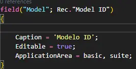

import { Aside } from '@astrojs/starlight/components';
import { Badge } from '@astrojs/starlight/components';

## Uso Prefijos / Sufijos

En la extensión, el nombre de cada nuevo objeto de aplicación (tabla, página, unidad de código) debe contener un prefijo o sufijo. Esta regla se aplica a todos los objetos. Al modificar un objeto principal de Dynamics 365 mediante una extensión de tabla o una extensión de página, el prefijo/sufijo debe definirse en el nivel de control/campo/acción/grupo.

### Reglas Generales

- El prefijo/sufijo debe tener exactamente tres caracteres
- El nombre del objeto/campo debe comenzar o terminar con el prefijo/sufijo
- Si surge un conflicto, siempre gana el que registró el prefijo/sufijo
- Para sus propios objetos y objetos de extensión, puede usar un espacio de nombres de al menos dos niveles o debe establecer el prefijo/sufijo en el nivel superior del objeto
- En el caso de las páginas, tablas, enumeraciones, informes, conjuntos de permisos de la aplicación base u otras aplicaciones que extienda, debe establecer el prefijo o el sufijo en el nivel de control/campo/acción/procedimiento/valores/elemento de datos/columna
- En el caso de los objetos de extensión que extienden objetos del mismo editor que la aplicación, no se necesitan afijos en el nivel de control/campo/acción/procedimiento/valores/elemento de datos/columna

### Para las extensiones de AppSource

Para cumplir los requisitos de la validación técnica de AppSource, debe tener un afijo de tres letras registrado para el editor de la extensión y debe usar el afijo en la extensión.

> **Nota**
> 
> 
> Los afijos no distinguen entre mayúsculas y minúsculas, lo que significa que, por ejemplo, "ABC", "abc" y "AbC" se tratan como el mismo afijo. Proporcionar tanto "ABC" como "abc" cuenta como solo una de sus sugerencias.
> 

### Ejemplos de objetos

```csharp
table 70000000 MyPrefixSalesperson /* Prefijo */
{
    Caption = 'Sales Person';
}

table 70000001 SalespersonMySuffix /* Sufijo */ 
{
    Caption = 'Sales Person';
}

table 70000000 VOG_Salesperson /* Prefijo */
{
    Caption = 'Sales Person';
}

table 70000001 Salesperson_VOG /* Sufijo */ 
{
    Caption = 'Sales Person';
}
```

```csharp
page 70000000 MyPrefixSalesperson /* Prefijo */
{
    Caption = 'Sales Person';
}

page 70000001 SalespersonMySuffix /* Sufijo */
{
    Caption = 'Sales Person';
}

page 70000000 VOG_Salesperson /* Prefijo */
{
    Caption = 'Sales Person';
}

page 70000001 SalespersonMy_VOG /* Sufijo */
{
    Caption = 'Sales Person';
}
```

```csharp
codeunit 70000000 MyPrefixSalesperson /* Prefijo */

codeunit 70000001 SalespersonMySuffix /* Sufijo */

codeunit 70000000 VOG_Salesperson /* Prefijo */

codeunit 70000001 Salesperson_VOG /* Sufijo */
```

## Clasificacion de campos con DataClassification

Debido a los requisitos de las leyes y normativas de privacidad, los campos de la clase de campo deben usar la propiedad DataClassification y su valor debe ser diferente de *ToBeClassified*. Esto se aplica a los campos de las tablas y las extensiones de tabla.

En la tabla siguiente se describen los niveles de confidencialidad de datos que se pueden asignar.

| Sensibilidad | Descripción |
| --- | --- |
| AccountData | Información de facturación del cliente e información del instrumento de pago, incluida la información de contacto del administrador, como el nombre, la dirección o el número de teléfono del administrador del inquilino. |
| CustomerContent | Contenido proporcionado o creado directamente por administradores y usuarios. El valor predeterminado es |
| SystemMetadata | Datos generados mientras se ejecuta el servicio o programa que no se pueden vincular a un usuario o inquilino. |
| EndUserIdentifiableInformation | (EUII) Datos que identifican o podrían utilizarse para identificar al usuario de un servicio de Microsoft. EUII no incluye contenido del Cliente. |
| EndUserPseudonymousIdentifiers | (EUPI) Un identificador creado por Microsoft y vinculado al usuario de un servicio de Microsoft. Al combinarse con otra información, como una tabla de mapeo, EUPI identifica al usuario final. EUPI no contiene información cargada ni creada por el cliente (contenido del cliente o EUII). |


## Uso de ApplicationArea

Las páginas, los controles, las acciones y los campos no aparecerán en Dynamics 365 Business Central si no se ha establecido.

**Se aplica a:**

- Page Label
- Page Field
- Page Part
- Page System Part
- Page Chart Part
- Page Action
- Page Custom Action
- Page File Upload Action
- Page User Control
- Page
- Report

### Tipo de Valores

| Valores | Descripcion |
| --- | --- |
| All | Se va a aplicar a todas las versiones |
| Basic | Solo se Aplica a la version basica de business central |
| Suite | Solo se Aplica a la version premium de business central |




<Aside type='note' title='Nota'>La extension no se instala en produccion sin que todos los campos tenga un ApplicationArea configurado.</Aside>

## Uso de UsageCategory

Para Habilitar la busqueda a traves de Dynamics 365 Busines Central de debe declarar el uso de la propiedad **UsageCaterory**

Para Habilitar la busqueda a traves de Dynamics 365 Busines Central de debe declarar el uso de la propiedad **UsageCaterory**

| Valores | Descripcion |
| --- | --- |
| **None** | La página, el informe o la consulta no se incluyen en una búsqueda. |
| **Lists** | La pagina, el informa o la consulta se enumeran como **Listas**, en la categoria **Paginas y Tareas** |
| **Tasks** | La pagina, el informa o la consulta aparecen como **Tareas**, en la categoria **Paginas y Tareas** |
| **ReportsAndAnalysis** | La pagina, el informa o la consulta aparecen como **Informes**, en la categoria **Informes y analisis** |
| **Documents** | La pagina, el informa o la consulta aparecen como **Informes y analisis**, en la categoria **Informes y analisis** |
| **History** | La pagina, el informe o la consulta aparecen como **Archivo en la categoria Informes y analisis** |
| **Administration** | La consulta aparece como **Administracion** en la categoria **Pagina y tareas** |

## Paginas de API

Las páginas de API son diferentes de las páginas de interfaz de usuario. Requieren diferentes propiedades y no se comportan de la misma manera. Dado que las páginas de API se utilizan para la integración con aplicaciones externas, deben tratarse como contratos. Para lograr esto, los siguientes temas son importantes.

- Aplicación de API independiente
- Propiedades de la página
- Control de versiones
- Propiedades de campo
- Campos predeterminadoS

Es una buena práctica desarrollar páginas de API en una aplicación independiente en lugar de combinarlas en una solución. Al hacerlo, proporciona una mejor capacidad de mantenimiento y es una buena manera de separar las preocupaciones

Las propiedades que se deben definir son:

### APIPublisher

El nombre del editor de la API suele ser la empresa que crea la API. Es la primera parte personalizada de la dirección URL de un punto de conexión determinado. El valor no distingue entre mayúsculas y minúsculas.

```csharp
APIPublisher = 'contoso';
```

### APIGroup

Establece el grupo del punto de conexión de la API en el que se expone la página o la consulta. En la dirección URL, APIGroup viene después de APIPublisher. Se puede usar para distinguir diferentes aplicaciones de API o grupos de API entre sí. El valor no distingue entre mayúsculas y minúsculas.

```csharp
APIGroup = 'app1';
```

### APIVersion

Establece las versiones del punto de conexión de la API en el que se expone la página o la consulta. Esta propiedad no es obligatoria. Si no se especifica, las API se expondrán como versión 'beta'.

La APIVersion se puede establecer en 'beta' o tener el formato 'vx.y'. Ejemplo:

```csharp
APIVersion = 'beta';
```

### Múltiples versiones de API

**Nunca** debe romper las versiones existentes. Cualquier cambio importante requiere la creación de una nueva versión.

Es posible exponer una API en varias versiones:

```csharp
    APIVersion = 'beta', 'v1.0';
```

Esto permite publicar una nueva versión de una aplicación API sin copiar todos los objetos individuales y actualizar los números de versión. Solo es necesario copiar los objetos de API que se modifican en una nueva versión. Los demás objetos solo necesitan una adición a la propiedad APIVersion para estar disponibles en el punto de conexión de la nueva versión

### EntitySetName

EntitySetName es el nombre de la entidad en plural. Piense en ello como el nombre de la colección de entidades. Se recomienda utilizar camelCasing para esta propiedad. ¡El valor distingue entre mayúsculas y minúsculas!

```csharp
EntitySetName = 'itemCategories';
```

### EntityName (Nombre de la entidad)

EntityName establece el nombre de entidad singular para la página o consulta de la API. Este nombre no se utiliza en la URL. En su lugar, se usa EntityName en la información de metadatos. Se recomienda utilizar camelCasing para esta propiedad.

```csharp
EntityName = 'itemCategory';
```

### DelayedInsert

Esta propiedad es necesaria en una página de API editable. No se aplica a un objeto de consulta de API. Si se establece en la página de la API, DelayedInsert no es necesario. Todas las páginas de API aplican el comportamiento para especificar primero todos los valores de campo y, a continuación, insertar el registro a la vez.`Editable = false`

```csharp
DelayedInsert = true;
```

### Ejemplo Completo

```csharp
PageType = API;
APIPublisher = 'contoso';
APIGroup = 'app1';
APIVersion = 'v1.0';
EntitySetName = 'itemCategories';
EntityName = 'itemCategory';
DelayedInsert = true;
```

### Propiedades de campo

La estructura base de una página de API es similar a una página de lista de interfaz de usuario

```csharp
layout
{
		area(Content)
		{
			repeater(records)
			{
			...
			}
    }
}
```

Al especificar los campos, hay que tener en cuenta algunas consideraciones.

- No hay propiedades obligatorias. La propiedad no desempeña ningún papel en las páginas de la API, por lo que se puede omitir.
- La propiedad también es opcional y solo se debe usar en caso de que la aplicación externa requiera subtítulos y el título debe ser diferente del título estándar.
- El nombre del campo, debe definirse en camelCasing. No puede contener espacios, puntos u otros caracteres especiales

### Campos obligatorios

- SystemId
    - **Este campo debe exponerse con el nombre id**
- SystemModifiedAt
    - Este campo debe exponerse con el nombre . Si eliges un nombre diferente, la funcionalidad del webhook no funcionará correctamente.

```csharp
layout
{
    area(Content)
    {
        repeater(records)
        {
            field(id; Rec.SystemId) { }
            field(lastModifiedDateTime; Rec.SystemModifiedAt) { }
        }
    }
}
```

## Uso de Begin.. End

Solo use begin.. end para encerrar instrucciones compuestas

### Ejemplo

```csharp
if FindSet() then begin
    repeat
        ...
    until next() = 0;
end;

```

```csharp
if FindSet() then
    repeat
        ...
    until next() = 0;
```

Codigo Correcto

```csharp
// xcepcion del caso
if X then begin
    if Y then 
        //Hacer Algo
end else 
    (not X)
```

No utilice líneas en blanco:

- al principio o al final de cualquier función (después y antes de `begin end`)
- dentro de la expresión multilínea
- después de las líneas en blanco


## Espaciado de comentarios

Comience siempre los comentarios con // seguido de un carácter de espacio

### Ejemplo

```csharp
RowNo += 1000; //Move way below the budget  
```

```csharp
RowNo += 1000; // Move way below the budget
```

## Espaciado de CASE

Una acción CASE debe comenzar en una línea después de la posibilidad.

### Ejemplo

```csharp
case Letter of
        'A': Letter2 := '10';
        'B': Letter2 := '11';
  end;
```

```csharp
case Letterof
        'A':
            Letter2:= '10';
        'B':
            Letter2:= '11';end;
```

## Orden de las declaraciones de variables

Las declaraciones de variables deben ordenarse por tipo. En general, los tipos de objetos y variables complejas se enumeran primero, seguidos de las variables simples. El orden debe ser:

- Record
- Report
- Codeunit
- XmlPort
- Page
- Query
- Notification
- BigText
- DateFormula
- RecordId
- RecordRef
- FieldRef
- FilterPageBuilder


```csharp
 StartingDateFilter: Text;
    Vendor: Record Vendor;

    //Incorrecto
```

```csharp
 Vendor: Record Vendor;
  StartingDateFilter: Text;

  //Correcto
```

## Verdadero/falso innecesario

No utilice palabras clave o innecesariamente si la expresión ya es una expresión lógica.`true / false`

### Ejemplo 1

```csharp
if IsPositive() = true then //Incorrecto
```

```csharp
if IsPositive() then //Correcto
```

### Ejemplo 2


```csharp

if Complete <> true then //Incorrecto
```

```csharp
 if not Complete then //Correcto
```

## Invocaciones de objectos con nombre

Al llamar a un objeto de forma estática, utilice el nombre del objeto, no el identificador del objeto

### Ejemplo

```csharp
  Page.RunModal(525, SalesShptLine); //Incorrecto
```

```csharp
 Page.RunModal(Page::"Posted Sales Shipment Lines", SalesShptLine); //Correcto
```

## Uso de la propiedad SetLoadFileds

Para el rendimiento del código, es importante que utilice SetLoadFields tanto como sea posible.

Si desea recuperar un registro de la base de datos para comprobar si el registro está disponible, utilice siempre SetLoadFields en los campos de clave principal de la tabla, de modo que solo se recuperen esos campos de la base de datos.

### Ejemplo

```csharp
if not Item.Get(ItemNo) then  //Incorrecto
    exit();
```

```csharp
Item.SetLoadFields("No.");
if not Item.Get(ItemNo) then //Correcto
    exit();
```